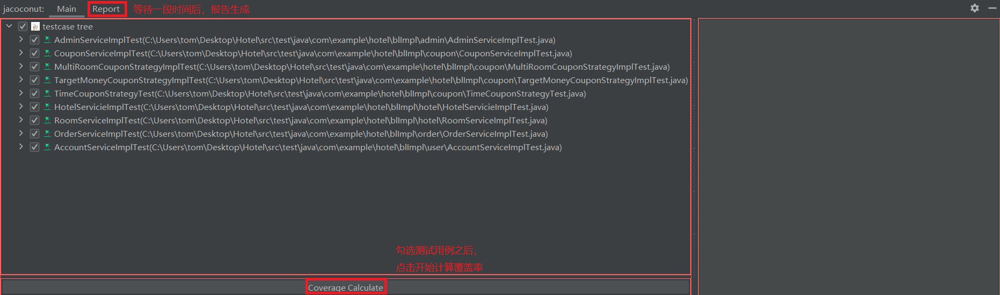
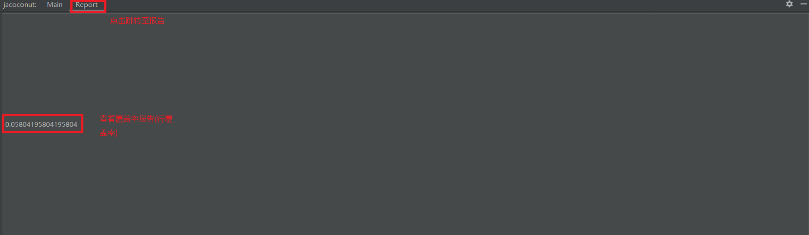

# jacoconut-front
Jacoconut's frontend，gradle-built intellij plugin，written in Swing &amp; Java.

## User Guide

1. Navigate Routines(View|Tool Windows|Jacoconut)

2. 点击箭头查看用例树详情

3. 双击测试类/测试方法跳转到对应源代码位置

4. 右击选中testcase集合

5. 点击计算覆盖率(源项目经过编译、字节码加强、测试用例执行、数据收集四个阶段)

6. 查看测试报告

## Feature
- 测试用例检索
- 代码跳转
- 覆盖率
  - 行覆盖率