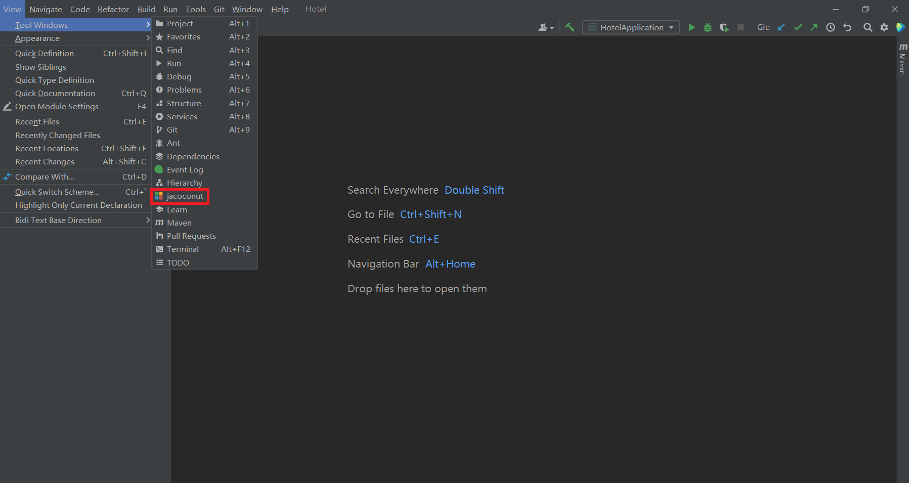
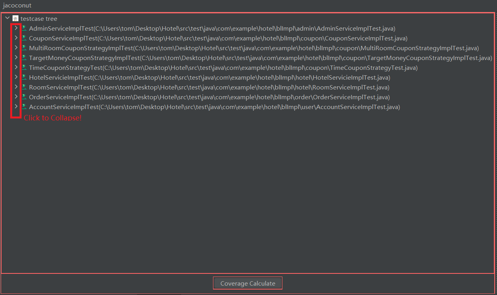
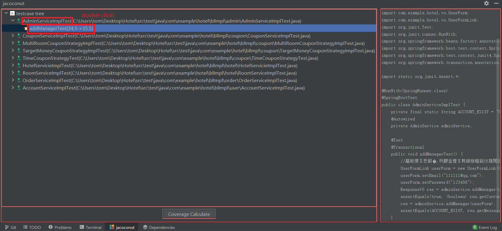
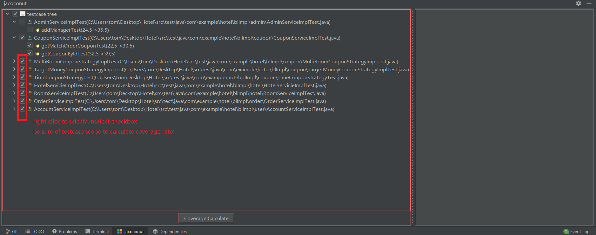

# jacoconut-front
Jacoconut's frontend，gradle-built intellij plugin，written in Swing &amp; Java.

***

1. Navigate Routines(View|Tool Windows|Jacoconut)

{:height="100px" width="400px"}

2. 点击箭头查看用例树详情

{:height="100px" width="400px"}

3. 双击测试类/测试方法跳转到对应源代码位置

{:height="100px" width="400px"}

4. 右击选中testcase集合

{:height="100px" width="400px"}
